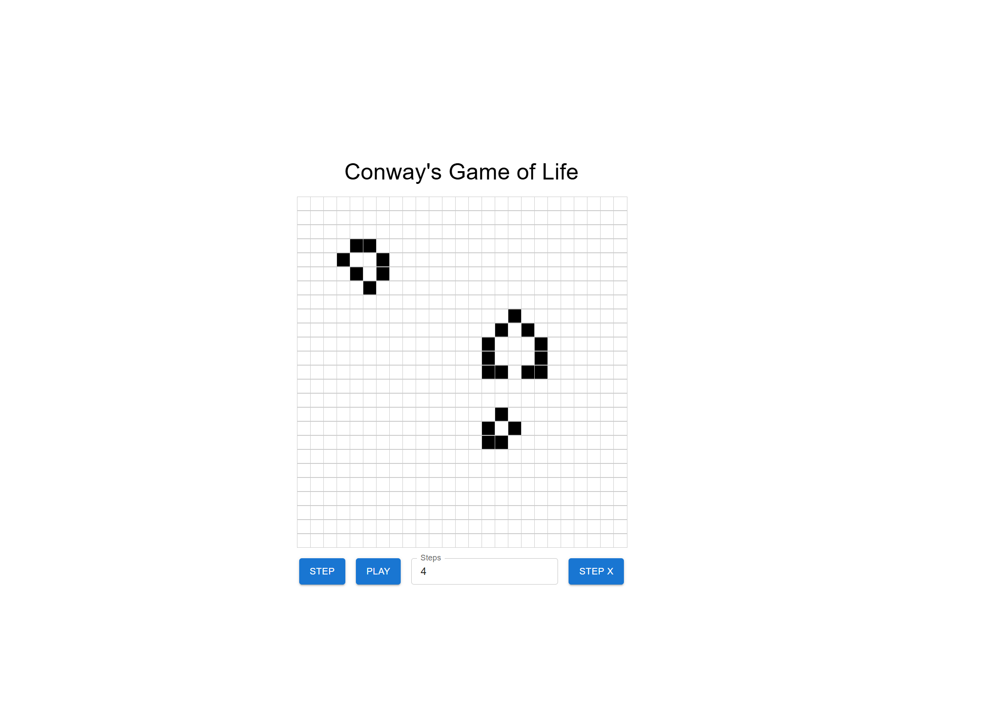
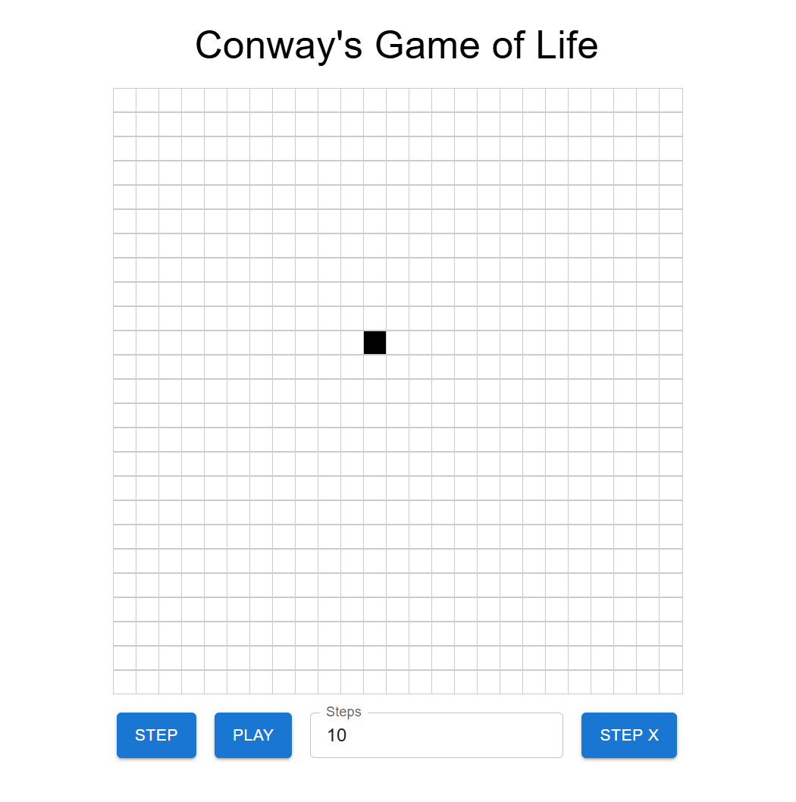

# Conway's Game of Life – React + TypeScript + MUI

This project is a front-end simulation of **Conway's Game of Life** built with **React**, **TypeScript**, and **Material UI (MUI)**. The simulation is self-contained and treats the game logic as an internal API to showcase clean architecture and scalable design.

## 🧪 Features

- Interactive grid where users can toggle cells on/off
- Step through the simulation one generation at a time
- Auto-play to run the game continuously
- Jump forward by X generations
- Game logic is modular and testable
- Responsive and centered UI using MUI

## 📸 Demo

> Click on cells to toggle their state. Use the controls to simulate life cycles.
> 
> 

## 📦 Tech Stack

- ⚛️ React + TypeScript
- 💅 Material UI (MUI)
- 🔁 Custom hook to manage simulation
- 🧪 Jest for testing

## 🚀 Getting Started

### 1. Clone the repository

```bash
git clone https://github.com/luisjjavier/react-game-of-life.git
cd game-of-life
```
### 2. Install dependencies

```bash 
npm install
```
### 3. Start the development server

```bash 
npm run dev
```
### 4. Project structure

``` 
src/
├── __test__/          # for Jest tests
├── api/             # Game logic (acts as a mock API)
├── components/      # UI components (Board, Controls)
├── hooks/           # useGameOfLife hook
├── types.ts         # Shared TypeScript types
├── App.tsx          # Main UI layout
└── main.tsx        # App entry point
```
## 🧠 Assumptions
Board size is fixed at 25x25 by default.

The game is implemented entirely on the frontend.

Interval delay for continuous play is 200ms.

## 🧪 Tests

1. **Run tests**:

```bash
npm test
```

This will run unit tests under `src/__tests__/*.test.ts` and validate simulation logic such as oscillators, underpopulation, and reproduction rules.
## 🐳 Docker (Production Ready)

1. **Build and run the container**:

```bash
docker build -t game-of-life .
docker run -p 8080:80 game-of-life
```

2. **Open in browser:**

```
http://localhost:8080
```
